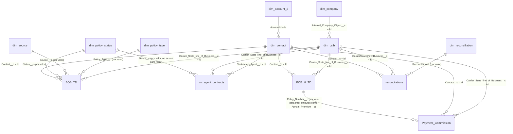

# Modelo semántico (mapa de relaciones)

Este archivo es la vista de pájaro de todo `schema/`: qué tabla se une con cuál, por qué
columna y de qué tipo es el join. Las fichas individuales en `schema/*.md` siguen siendo la
fuente de verdad del detalle (columnas, gotchas); este archivo solo consolida sus secciones
"Joins típicos" en un solo lugar para no tener que abrir los 9 archivos cada vez que se
necesita entender cómo llegar de una tabla a otra.

Si agregas una tabla nueva a `schema/`, agrega también su(s) relación(es) aquí.

## Diagrama

`BOB_TD` es la tabla de hechos central (una fila por póliza, snapshot único "hoy"). Todo lo
demás son dimensiones que cuelgan de ella, directa o indirectamente (`dim_account_2` y
`dim_company` son de "segundo salto": se llega a ellas pasando primero por `dim_contact` o
`dim_cslb`). `vw_agent_contracts` es una vista independiente (contratos de agentes) que
comparte dimensiones con `BOB_TD` pero no se une directamente a ella. `BOB_H_TD` es el
histórico de snapshots de `BOB_TD` (una fila por póliza por fecha de carga, ver
`schema/BOB_H_TD.md`) — se une a las mismas dimensiones `dim_cslb` y `dim_contact` (y, vía
`dim_contact`, a `dim_account_2`).

## Tabla de relaciones

| Desde | Columna | Hacia | Columna | Tipo de join | Ficha |
|---|---|---|---|---|---|
| `BOB_TD` | `Carrier_State_line_of_Business__c` | `dim_cslb` | `Id` | Por Id | [schema/BOB_TD.md](../../schema/BOB_TD.md), [schema/dim_cslb.md](../../schema/dim_cslb.md) |
| `BOB_TD` | `Policy_Type__c` | `dim_policy_type` | `Policy_Type__c` | Por valor (texto) | [schema/dim_policy_type.md](../../schema/dim_policy_type.md) |
| `BOB_TD` | `Source__c` | `dim_source` | `Source__c` | Por valor (texto) | [schema/dim_source.md](../../schema/dim_source.md) |
| `BOB_TD` | `Status__c` | `dim_policy_status` | `Status` | Por valor (texto) | [schema/dim_policy_status.md](../../schema/dim_policy_status.md) |
| `BOB_TD` | `Contact__c` | `dim_contact` | `Id` | Por Id | [schema/dim_contact.md](../../schema/dim_contact.md) |
| `dim_contact` | `AccountId` | `dim_account_2` | `Id` | Por Id | [schema/dim_account_2.md](../../schema/dim_account_2.md) |
| `dim_cslb` | `Internal_Company_Object__c` | `dim_company` | `Id` | Por Id | [schema/dim_company.md](../../schema/dim_company.md) |
| `vw_agent_contracts` | `Contracted_Agent__c` | `dim_contact` | `Id` | Por Id | [schema/vw_agent_contracts.md](../../schema/vw_agent_contracts.md) |
| `vw_agent_contracts` | `Carrier_State_line_of_Business__c` | `dim_cslb` | `Id` | Por Id | ídem |
| `vw_agent_contracts` | `Status__c` | `dim_policy_status` | `Status` | Por valor — el resultado **no se usa** para filtrar en `agents-with-active-contracts.md` | ídem |
| `BOB_H_TD` | `Carrier_State_line_of_Business__c` | `dim_cslb` | `Id` | Por Id | [schema/BOB_H_TD.md](../../schema/BOB_H_TD.md) |
| `BOB_H_TD` | `Contact__c` | `dim_contact` | `Id` | Por Id | ídem |
| `reconcilations` | `Reconciliations` | `dim_reconciliation` | `Type_reconciliations` | Por valor (texto) | [schema/reconcilations.md](../../schema/reconcilations.md), [schema/dim_reconciliation.md](../../schema/dim_reconciliation.md) |
| `reconcilations` | `CarrierStateLineOfBusiness__c` | `dim_cslb` | `Id` | Por Id | [schema/reconcilations.md](../../schema/reconcilations.md) |
| `reconcilations` | `contact__c` | `dim_contact` | `Id` | Por Id | ídem |
| `Payment_Commission` | `Carrier_State_line_of_Business__c` | `dim_cslb` | `Id` | Por Id | [schema/Payment_Commission.md](../../schema/Payment_Commission.md) |
| `Payment_Commission` | `Contact__c` | `dim_contact` | `Id` | Por Id | ídem |
| `Payment_Commission` | `Policy_Number__c` | `BOB_H_TD` / `BOB_TD` | `Policy_Number__c` | Por valor — solo para traer atributos de la póliza (ej. `Annual_Premium__c`), no está modelado como relación en Power BI | ídem |

## Cadenas de 2+ saltos (útiles para filtros del dashboard)

Ver también `context/filters/producers-dashboard-filters.md` y `context/filters/bob-history-dashboard-filters.md`
para el detalle de qué segmentador de cada dashboard usa cada una de estas cadenas.

- **Agencia de una póliza**: `BOB_TD.Contact__c` → `dim_contact.Id` → `dim_contact.AccountId` → `dim_account_2.Id`
- **Compañía interna de una póliza**: `BOB_TD.Carrier_State_line_of_Business__c` → `dim_cslb.Id` → `dim_cslb.Internal_Company_Object__c` → `dim_company.Id`

## Preguntas abiertas / gaps (agregado de lo ya flaggeado en cada ficha)

- **`BOB_TD` vs `Book_of_Business`**: el dashboard de Power BI llama a la tabla de hechos
  `Book_of_Business` con una columna `Val.BOB_H`; las consultas verificadas de este repo usan
  `claro_bi.BOB_TD` con `Val_BOB_TD`. Pendiente confirmar si son la misma tabla antes de
  asumir que toda relación documentada aquí para `BOB_TD` aplica igual a `Book_of_Business`.
- **`dim_policy_status.Status` vs `Status_Category`**: no es un gap de relación (ambas
  columnas viven en la misma tabla y se unen igual), pero sí de qué columna usar como
  estándar — Overview/Paid Members del dashboard filtran por `Status_Category`, Producers y
  todas las consultas verificadas usan `Status`.
- **`dim_company`**: relación documentada a partir del mapeo de segmentadores del dashboard,
  no de inspección directa en BigQuery. Confirmar dataset/columnas con `get_table_info` antes
  de usarla en una consulta verificada nueva.
- **`dim_calendar`**: aparece en el dashboard relacionada con `Book_of_Business.Effective_Date__c`
  pero no tiene ficha en `schema/` todavía ni se usa en ninguna consulta verificada — no
  incluida en el diagrama de arriba hasta que se documente.
